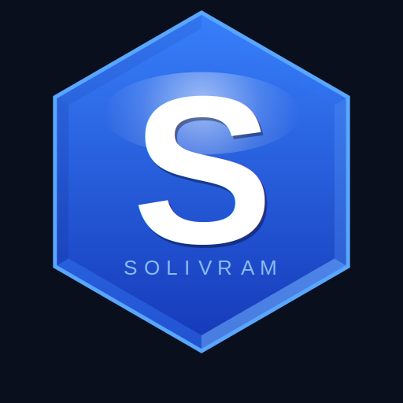

# solivram

<p align="center">
  
</p>


[](https://github.com/Solivram/solivram/blob/main/README.md)
[](https://github.com/Solivram/solivram/blob/main/README_EN.md)

> Infrastructure distribuée haute disponibilité, sécurisée post-quantique, observable et extensible, conçue en Rust pur pour des environnements critiques.

<p align="center">
  <a href="https://github.com/Solivram/solivram-releases/releases">
    
  </a>
</p>

**Auteur** : Jenka Nauta — France
**Version** : 0.1.0 — 2026-03-11
**Type** : Serveur / Daemon
**Releases** : [solivram-releases](https://github.com/Solivram/solivram-releases/releases)

---

## Catégories

`Sécurité` · `Infrastructure distribuée` · `Post-Quantum Cryptography` · `Rust`

---

## Capacités principales

| Module | Description |
|--------|-------------|
| **Cluster Raft HA** | Élection, réplication, snapshot, membership dynamique |
| **PKI X.509 interne** | CA racine, intermédiaire, feuilles, CRL |
| **DNS souverain + DNSSEC** | Dual P-256 + ML-DSA-65 |
| **Hybridation PQC** | ML-KEM-768 (encapsulation) + ML-DSA-65 (signature) |
| **API REST** | Axum — auth Bearer, RBAC 5 rôles, rate-limiter, CORS |
| **Stockage chiffré** | redb + AES-256-GCM + rotation des clés |
| **Reverse proxy HA** | Circuit-breaker, backends dynamiques |
| **Chiffrement E2E** | ML-KEM-768 + AES-256-GCM, bout en bout entre clients |
| **Trust inter-nœuds** | Signaux de confiance, API admin accept/revoke |
| **GUI native** | Interface egui |
| **Sessions sécurisées** | TTL 1h + 2FA TOTP RFC 6238 |

---

## Cibles

- Équipes DevOps / SRE cherchant une infra Rust production-grade
- Entreprises PKI nécessitant une CA interne auditable
- Chercheurs en cryptographie post-quantique (PQC)
- Éditeurs SaaS B2B requérant haute disponibilité et conformité

---

## Exemple — Autorité de certification

Une autorité de certification déploie solivram pour :

- Gérer sa PKI X.509 (CA racine, intermédiaire, feuilles, CRL)
- Stocker les clés en AES-256-GCM avec rotation automatique
- Signer en post-quantique via ML-DSA-65
- Contrôler les accès par rôles (Admin / Opérateur / Superviseur / Lecteur / Invité) avec 2FA TOTP RFC 6238
- Assurer la haute disponibilité via cluster Raft multi-nœuds
- Auditer chaque opération via API REST Bearer + RBAC

---

## Prérequis système

- **OS** : Debian 11+ / Ubuntu 20.04+ (amd64 x86-64)
- **Architecture** : x86-64 uniquement

```bash
# Vérifier l'architecture
uname -m  # doit afficher x86_64
```

## Installation

### Debian / Ubuntu

```bash
# Via curl (recommandé)
curl -LO https://github.com/Solivram/solivram-releases/releases/download/v0.1.0/solivram_0.1.0_amd64.deb && sudo dpkg -i solivram_0.1.0_amd64.deb

# Ou télécharger manuellement
sudo dpkg -i solivram_0.1.0_amd64.deb
solivram --help
```

**Dépendances** :

### Configuration PATH

```bash
# Ajouter solivram au PATH (permanent)
echo 'export PATH=$PATH:/usr/bin' >> ~/.bashrc && source ~/.bashrc
```

### Permissions d'exécution

```bash
# Si le binaire est bloqué à l'exécution
chmod +x /usr/bin/solivram

# Autoriser les ports < 1024 sans sudo
sudo setcap cap_net_bind_service=+ep /usr/bin/solivram
```

### Si bloqué par l'OS (AppArmor / SELinux)

```bash
# Vérifier si AppArmor bloque solivram
sudo aa-status | grep solivram

# Désactiver AppArmor temporairement pour solivram
sudo aa-complain /usr/bin/solivram

# Ou ajouter une exception SELinux
sudo semanage fcontext -a -t bin_t '/usr/bin/solivram'
sudo restorecon -v /usr/bin/solivram
``` `libwayland-client0` · `libudev1` · `libasound2` · `libgcc-s1` · `libc6` · `libffi8` · `libcap2`

---

## Vérification de signature

```bash
solivram identity:verify
# ✅ P-256 valide | ✅ ML-DSA valide
```

**Clé publique P-256 :**
```
04fa81886487fa97a92bf77756252ffbb17cfdec1ca55131e7bf94920a14f00faf6af84fb9680f1d3c367cba6c09fa17dc1e2edd3005173ed599fcc091973a3091
```

---


## Vérification post-installation

```bash
solivram --version
solivram --help
solivram identity:verify
# ✅ P-256 valide | ✅ ML-DSA valide
```

## Premier démarrage

```bash
# Lancer solivram en mode terminal
solivram

# Lancer solivram en mode GUI
solivram --gui
```

## Désinstallation

```bash
sudo dpkg -r solivram
```

## Documentation

| Document | Français | English |
|----------|----------|---------|
| **Mise en garde** | [Solivram_Mise_En_Garde_FR.pdf](https://github.com/Solivram/solivram-releases/releases/download/v0.1.0/Solivram_Mise_En_Garde_FR.pdf) | [Solivram_Warning_EN.pdf](https://github.com/Solivram/solivram-releases/releases/download/v0.1.0/Solivram_Warning_EN.pdf) |
| **Quickstart** | [Solivram_Quickstart.pdf](https://github.com/Solivram/solivram-releases/releases/download/v0.1.0/Solivram_Quickstart.pdf) | [Solivram_Quickstart_EN.pdf](https://github.com/Solivram/solivram-releases/releases/download/v0.1.0/Solivram_Quickstart_EN.pdf) |

---

## FAQ

**Q : Rust doit-il être installé pour utiliser solivram ?**
Non. Le paquet `.deb` contient un binaire déjà compilé. Rust n'est requis que pour compiler depuis les sources.

**Q : Solivram fonctionne-t-il sur ARM / Raspberry Pi ?**
Pas encore. Seule l'architecture amd64 (x86-64) est supportée en v0.1.0.

**Q : Le binaire est-il signé ?**
Oui. Solivram embarque une identité P-256 + ML-DSA-65 vérifiable via `solivram identity:verify`.

**Q : Comment mettre à jour solivram ?**
```bash
curl -LO https://github.com/Solivram/solivram-releases/releases/download/v0.1.0/solivram_0.1.0_amd64.deb && sudo dpkg -i solivram_0.1.0_amd64.deb
```

## Pitchs sectoriels

| Secteur | Français | English |
|---------|----------|---------|
| Défense | [Pitch_Defense_FR.pdf](https://github.com/Solivram/solivram-releases/releases/download/v0.1.0/Solivram_Pitch_Defense_FR.pdf) | [Pitch_Defense_EN.pdf](https://github.com/Solivram/solivram-releases/releases/download/v0.1.0/Solivram_Pitch_Defense_EN.pdf) |
| Santé | [Pitch_Sante_FR.pdf](https://github.com/Solivram/solivram-releases/releases/download/v0.1.0/Solivram_Pitch_Sante_FR.pdf) | [Pitch_Healthcare_EN.pdf](https://github.com/Solivram/solivram-releases/releases/download/v0.1.0/Solivram_Pitch_Healthcare_EN.pdf) |
| Finance | [Pitch_Finance_FR.pdf](https://github.com/Solivram/solivram-releases/releases/download/v0.1.0/Solivram_Pitch_Finance_FR.pdf) | [Pitch_Finance_EN.pdf](https://github.com/Solivram/solivram-releases/releases/download/v0.1.0/Solivram_Pitch_Finance_EN.pdf) |
| Agents IA | [Pitch_Agents_IA_FR.pdf](https://github.com/Solivram/solivram-releases/releases/download/v0.1.0/Solivram_Pitch_Agents_IA_FR.pdf) | [Pitch_Agents_IA_EN.pdf](https://github.com/Solivram/solivram-releases/releases/download/v0.1.0/Solivram_Pitch_Agents_IA_EN.pdf) |
| Énergie / Industrie | [Pitch_Energie_FR.pdf](https://github.com/Solivram/solivram-releases/releases/download/v0.1.0/Solivram_Pitch_Energie_FR.pdf) | [Pitch_Energy_EN.pdf](https://github.com/Solivram/solivram-releases/releases/download/v0.1.0/Solivram_Pitch_Energy_EN.pdf) |
| Administrations | [Pitch_Admin_FR.pdf](https://github.com/Solivram/solivram-releases/releases/download/v0.1.0/Solivram_Pitch_Admin_FR.pdf) | [Pitch_Admin_EN.pdf](https://github.com/Solivram/solivram-releases/releases/download/v0.1.0/Solivram_Pitch_Admin_EN.pdf) |

---

*solivram — Jenka Nauta — France — 2026*